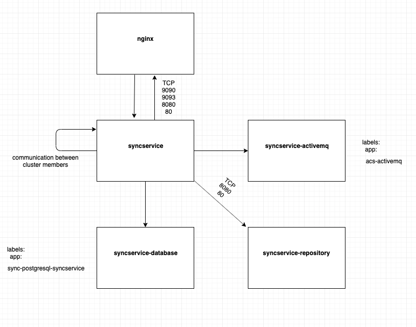

## Sync Service network policy

In order to have network policy applied, the `networkpolicysetting` paramether should be true, in values.yaml.
If you run locally, with Minikube, the cluster should be started, with parameter  --network-plugin=cni.

As a plugin you can install Weave. This one has in memory data-store and it's easy to be installed.
This is the command to install Weave:

``$ kubectl apply -f "https://cloud.weave.works/k8s/net?k8s-version=$(kubectl version | base64 | tr -d '\n')"``

The following diagram describes the communication between pods. The arrow indicates that one pod can communicate with another one in one direction, that's means that communication in reverse order is not possible.

Sync service defines a set of 4 policies, a policy for each of the following pod:
* [syncservice](../helm/alfresco-sync-service/templates/Rule_04-sync-network-policy-syncservice.yaml)
* [repository](../helm/alfresco-sync-service/templates/Rule_03-sync-network-policy-repository.yaml)
* [database](../helm/alfresco-sync-service/templates/Rule_01-sync-network-policy-database.yaml)
* [activemq](../helm/alfresco-sync-service/templates/Rule_02-sync-network-policy-activemq.yaml)
